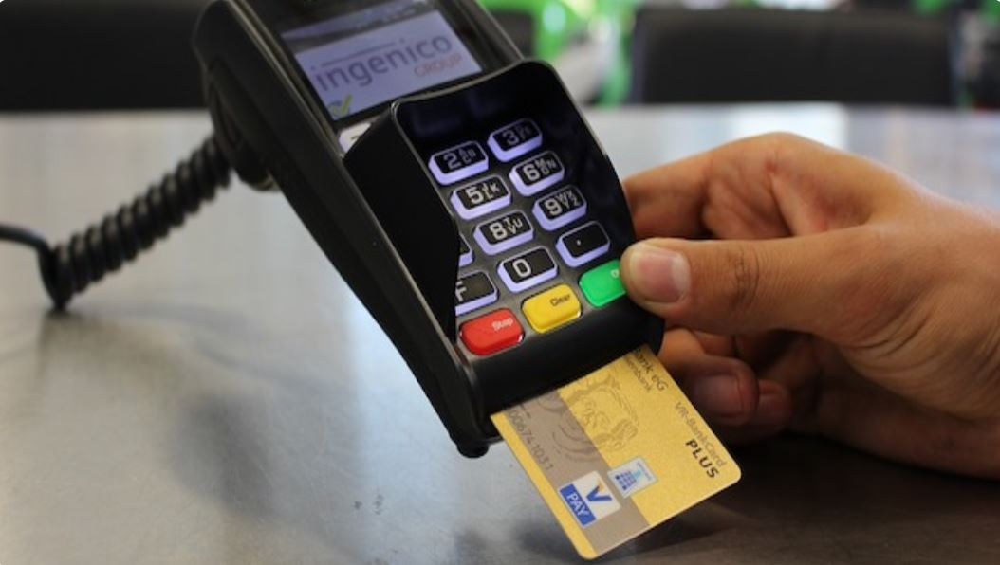
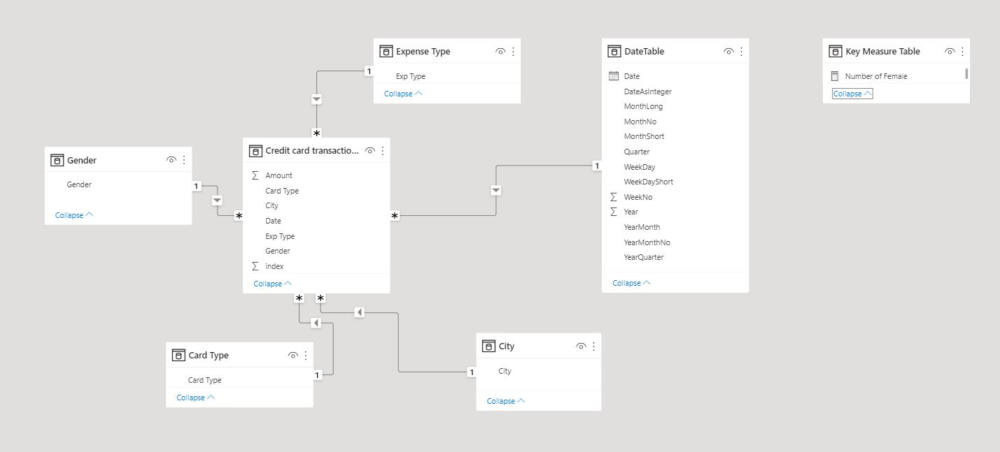
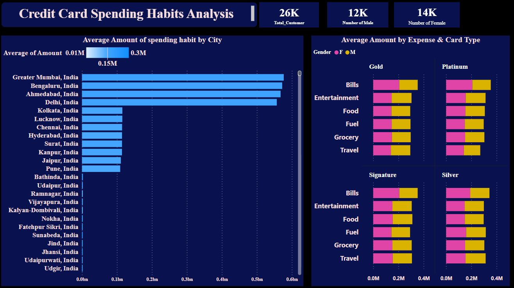
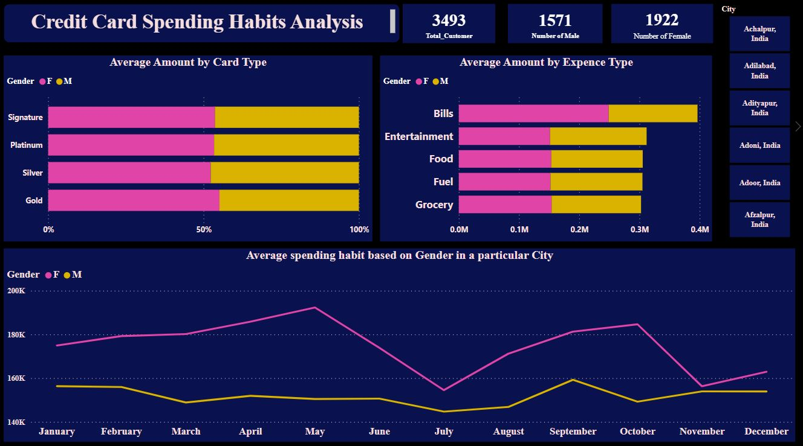
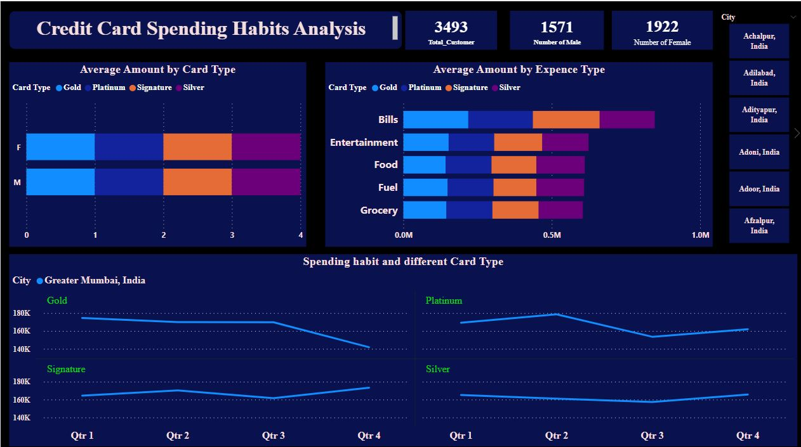

# Credit Card Spending Analysis

---
## Introduction:
This is a Power BI project on credit card spending habit of customer analysis in **india**. This dataset contains insights into a collection of credit card transactions made in India, offering a comprehensive look at the spending habits of Indians across the nation. From the Gender and Card type used to carry out each transaction, to which city saw the highest amount of spending and even what kind of expenses were made, this dataset paints an overall picture about how money is being spent in India today. The project is to analyze and derive insight to answer crucial questions and drive decision making.
**_Data Source_**: _The data is gotten from Kaggle_

## Problem Statement:
1. which city has the highest average spending amount?
2. To analyze consumer trends and interests by looking at the type of purchases people make based on their gender and city?
3. To analyze consumer trends and interests by looking at the type of purchases people make based on their card type?

## Skills/ Concept demonstrated:

The following Power BI features were incorporated:
- DAX,
- Quick measures,
- Modelling,
- Filters

## Modelling
Automatically derived relationships are adjusted to remove and replace unwanted relationship with the required

---
There are 5-dimentional tables and 1 fact table. The dimention tables are all joined to the fact table with a one-to-many relationship

## Visualization and Analysis:

The below analysis gives insight on average amount of customer spending in each city

---

The below analysis investigate into how gender is impacting customer spending habit across different cities, what card type they are using and what customer are spending on

---
The below analysis gives insight into spending habit and different card type used by customers and checking if there are any significant difference in average amount spent  among the card type

---

## Conclusion:

- The analysis has shown the top cities in india with high spending habit by customers which Great Mumbia is the number one city with the largest average amount
- The analysis also shows that a robust system that can track malicious spending activies should be put in place to tackle credit card spending theft across the cities and    most especially cities with large amount of spending for customer protection
- The analysis has also indicate the gender with the highest spending across month for the last three years (2013 - 2015) which is the female gender
- The analysis has shown that there is no large significant difference in the type of card used by customers with cities having large average amount

## Recommendation:

- Further analysis should be conducted on the benefit of the type of credit card and also tailor the result to customers within that segment
- A proactive system and tight security should be put in place to prevent malicious activities that can lead to loss of customers fund
- Further data collection and analysis should be conducted to know why cities with small average amount are not having or using the different credit card type

You can interact with the report [here](https://drive.google.com/file/d/1SGOyAgGiPHS84SQbZhxm-6yn4iuBRoG4/view?usp=drive_link)
